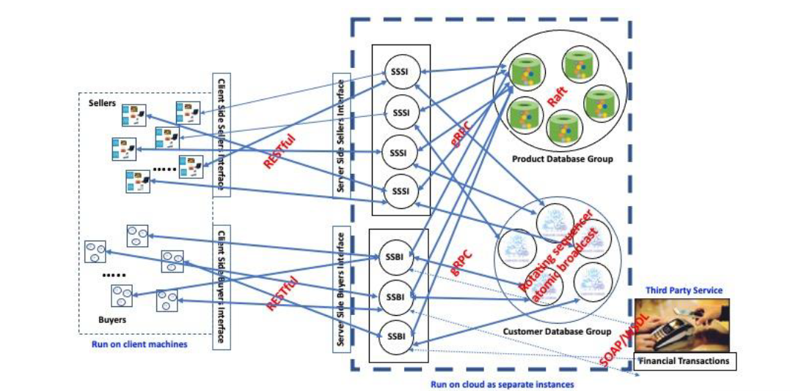

### Overall System Architecture

The system comprises several interconnected components, each serving a specific role in the functionality of the application. The main components include:

- **Buyer Server Frontend**
- **Seller Server Frontend**
- **Buyer Server Backend**
- **Seller Server Backend**

The server frontends act as intermediaries, receiving requests from clients and establishing connections with the relevant database instances. The database instances consist of the Product Database and Customer Database, each managed by separate server backends. The flow of a typical request follows this sequence:

**Client** ---*REST Request*---> **Server Frontend** ---*gRPC Request*---> **Target Backend Functionality** ---*MySQL Request*---> **Database Query**

**Target Backend Functionality** ---*SOAP Request*---> **Financial Server**

The current state of the application effectively supports all the functionalities outlined in the specification document. It operates under certain assumptions:

1. **Database Consistency:** Sellers and their corresponding items are linked through the seller ID, essentially forming a foreign key relationship. However, the application does not automatically handle the deletion of related objects when the reference object is deleted. Deletion is an independent operation performed by the server and may lack consistency in the event of node failure.

2. **Database Service Availability:** The system assumes that the backend database service is consistently operational before starting the server frontend service.

3. **Shopping Cart Handling:** The application assumes that the client is responsible for saving the cart when needed. It only retains changes made to the cart in memory until explicitly saved.

4. **Transaction History:** The user's transaction history is not stored as a timeline but rather as a snapshot of the cart when the "make purchase" functionality is invoked.

5. **Search Mechanism:** The buyer's search functionality attempts to match the existence of the exact keyword as a substring in the concatenated string of all keywords associated with a product.

This project is functionally similar to [Non-Replicated e-commerce](https://github.com/ADIthaker/REST_gRPC_Ecomm)!

### Versions

The [Simpler version](https://github.com/ADIthaker/EComm_Replicated/tree/master)! uses a simple global atomic rotating sequencer protocol. 

The protocol has three types of messages: Request message, Sequence message, and Retransmit request message.

Assume that a group has n members, each having a unique id, 0 ... n-1. A client may submit an application request to any one of the group members. On receiving an application request from a client, a group member sends a Request message to every group member. This message includes a unique request id <sender id, local seq number>, the client request, and some additional metadata. The local seq number included in the Request message is derived from a monotonically increasing counter that each group member maintains locally (initial value 0, incremented after sending each new Request message).
For each Request message, one of the group members assigns a global sequence number to this Request message and sends out a Sequence message to all group members. This message includes the assigned global sequence number, request ID of the Request message, and some additional metadata. The global sequence numbers are assigned in a (globally) monotonically increasing order starting from 0. The global sequence number assigned to a Request message determines the delivery order of that Request message.
The task of assigning global sequence numbers and sending Sequence messages is shared by all group members as follows: A Sequence message with global sequence number k is sent out by the group member whose member id is k mod n. This group member assigns this global sequence number to a Request message with request message id <s_id, l_seq#> and sends out a Sequence message under the following conditions: (1) it has received all Sequence messages with global sequence numbers less than k; (2) it has received all Request messages to which global sequence numbers less than k have been assigned; and (3) all Request messages sent by the member with member id s_id and local seq numbers less than l_seq# have been assigned a global sequence number.
A group member delivers a Request message with assigned global sequence number s to the application only after (1) it has delivered all Request messages with assigned global sequence numbers less than s, and (2) it has ensured that a majority of the group members have received all Request messages as well as their corresponding Sequence messages with global sequence numbers s or less.
Group members use the negative acknowledgment technique to recover from message losses. They send a Retransmit request message whenever they detect a missing Request message or a Sequence message. The Retransmit request message is sent to the sender of the missing message. The Retransmit message may also contain some metadata.

Finally, group members use UDP as the underlying communication protocol for all communication.

The [ass5 version](https://github.com/ADIthaker/EComm_Replicated/tree/ass5)! use a more involved protocol similar to Raft.

